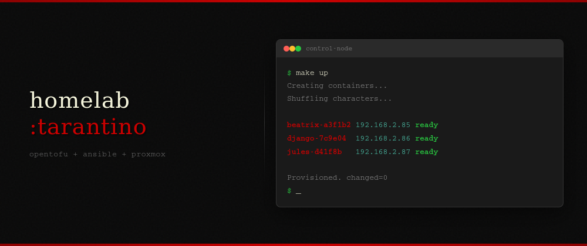

# homelab




I got tired of clicking through the Proxmox UI every time I needed a container. So I built this.

`make up` creates LXC containers, names them after Tarantino characters, pulls my SSH keys from GitHub, waits for DHCP, provisions them with Ansible, and gives me an SSH command to copy-paste. `make down` tears it all down. Same result every time.

```
lxc_containers = {
  testbox = {}
}
```

That's it. One entry, one container. Gets a name like `beatrix-a3f1b2`, comes with curl, htop, jq, vim, git pre-installed, timezone set, apt upgraded. Override what you need:

```hcl
lxc_containers = {
  docker = { cores = 4, memory = 4096, disk_size = "64G" }
  pihole = { memory = 256, disk_size = "4G" }
  devbox = { cores = 2, memory = 2048 }
}
```

## How it works

OpenTofu creates the containers. A `random_shuffle` picks a Tarantino character from a pool of 30 (Jules, Vincent, Beatrix, Django, etc.) and a `random_id` adds a hex suffix so names never collide. SSH keys come from `https://github.com/<username>.keys` on every apply.

After containers boot, a shell script hits the Proxmox API to get real IPs (DHCP means they're unknown at plan time). It retries every 5 seconds for up to a minute until all containers have addresses. Then it generates an Ansible inventory and runs the base role.

Second Ansible run shows `changed=0`. Idempotent.

## Getting started

You need OpenTofu, Ansible, and a Proxmox server with an API token.

```bash
git clone https://github.com/ayushverma8/homelab.git
cd homelab
cp terraform.tfvars.example secrets.auto.tfvars
```

Fill in `secrets.auto.tfvars` with your Proxmox URL, API token, and GitHub username. Then:

```bash
make init
make up
```

You'll see something like:

```
============================================
Infrastructure up and provisioned
============================================

SSH into your containers:
  ssh root@192.168.2.85
```

## Container defaults

Everything has a sane default. You only specify what's different.

| Parameter    | Default                                                   |
|-------------|-----------------------------------------------------------|
| target_node | proxmox                                                   |
| ostemplate  | local:vztmpl/ubuntu-22.04-standard_22.04-1_amd64.tar.zst |
| cores       | 1                                                         |
| memory      | 512 MB                                                    |
| disk_size   | 8G                                                        |
| disk_storage| local-lvm                                                 |
| bridge      | vmbr0                                                     |
| start       | true                                                      |

Validation catches garbage before it hits the API. `cores = 0`, `memory = 99999`, `disk_size = "big"` all fail at plan time with clear messages.

## What gets installed

The Ansible base role runs on every container:

curl, wget, htop, jq, vim, git, unzip, ca-certificates, gnupg, lsb-release. Timezone set to America/Toronto. Full apt upgrade and cleanup.

Nothing fancy. Just a solid base you can build on.

## Commands

| Command              | What it does                                      |
|---------------------|---------------------------------------------------|
| `make up`           | Create + provision + print SSH commands            |
| `make down`         | Destroy everything, clean inventory                |
| `make plan`         | Preview what tofu would do                         |
| `make provision`    | Re-run Ansible without recreating containers       |
| `make provision-check` | Dry run Ansible, see what would change          |
| `make inventory`    | Regenerate inventory from live Proxmox data        |
| `make fmt`          | Format .tf files                                   |
| `make validate`     | Check formatting + syntax                          |

## CI

GitHub Actions runs `tofu fmt -check`, `tofu validate`, and `ansible-lint` on every push. Keeps the repo honest.

## Things that broke along the way

**The field name nobody warns you about.** The inventory script was generating `ansible_host: null` for every container. Ansible would try to SSH to the hostname, which didn't resolve, and fail with a cryptic "could not resolve hostname" error. Turns out the Proxmox API returns IP data under `ip-address`, not `inet-addr` like most docs and examples suggest. One `jq` filter change fixed it, but it took 15 minutes of staring at curl output to figure out why a working API call was producing empty results.

**The race condition I didn't see coming.** `make up` would run `tofu apply`, then immediately generate the inventory. But the container had just booted and hadn't received its DHCP lease yet. The inventory came back empty, Ansible ran against zero hosts, and everything "succeeded" with nothing actually done. No errors, no warnings, just a fully provisioned nothing. Fixed it with a retry loop that polls the Proxmox API every 5 seconds, up to 60 seconds, waiting for all containers to report an IP before generating inventory.

**The lifecycle deadlock.** I wanted `prevent_destroy` on important containers so a stray `tofu destroy` wouldn't wipe my Pi-hole. OpenTofu requires `prevent_destroy` to be a literal boolean in the lifecycle block, you can't pass a variable. So I split containers into two resource blocks: `proxmox_lxc.protected` and `proxmox_lxc.unprotected`. Worked great until I needed to change the flag. Toggling a container from protected to unprotected meant OpenTofu wanted to destroy the old resource and create a new one. But the lifecycle rule blocked the destroy. Deadlock. The fix was `tofu state mv` to manually shuffle resources between blocks. For a homelab, this was way more complexity than the safety net was worth. Ripped it out entirely.

**The Cloudflare Tunnel that almost worked.** I integrated Cloudflare Tunnel so I could SSH into containers from anywhere. Got the tunnel created, DNS records pointing, `cloudflared` installed and running inside the container. Then hit a TLS handshake failure between `cloudflared` and Cloudflare's edge. Debugging tunnel routing, Access policies, and ingress rules for something I mostly access on my LAN was the definition of over-engineering. Removed the entire integration. Knowing when to delete code matters as much as knowing when to write it.

**The ansible-lint surprise.** Linting passed locally but failed in CI. Locally I had `community.general` installed from a previous project. The CI runner didn't. The `community.general.timezone` module couldn't resolve and the whole pipeline went red. Added `ansible-galaxy collection install community.general` to the CI workflow. Then lint complained that role variables needed a `base_` prefix. Then it complained about a missing newline at end of file. Three commits to fix what should have been caught before the first push. Now I run `ansible-lint` locally before every commit.

## License

MIT